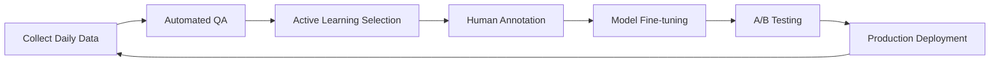

# Data Strategy: Rural Farming Assistant

## Executive Summary

This document outlines the comprehensive data strategy for the Rural Farming Assistant, covering dialect-specific speech data acquisition, agricultural knowledge curation, model training pipelines, and continuous improvement mechanisms. The strategy emphasizes ethical data collection, farmer privacy, and progressive enhancement from limited initial data to comprehensive coverage.

## Data Categories and Requirements

### 1. Speech and Language Data

#### Dialect-Specific Speech Data
**Current Challenge**: Limited availability of rural Indian dialect speech data

**Target Requirements**:
- 500+ hours of transcribed speech per major dialect
- Coverage of agricultural domain vocabulary
- Mixed-language (code-switching) samples
- Noisy environment recordings (farm ambiance)
- Gender and age diversity in speakers

**Priority Languages (Phase 1)**:
1. Hindi variants: Bhojpuri, Haryanvi, Bundeli
2. Tamil variants: Kongu, Madras, Nellai
3. Marathi variants: Varhadi, Konkani influence

#### Agricultural Terminology Corpus
- 10,000+ agriculture-specific terms per language
- Crop names (local and scientific)
- Disease and pest terminology
- Traditional farming vocabulary
- Market and trade terms
- Government scheme names

### 2. Agricultural Knowledge Data

#### Validated Agricultural Content
**Sources**:
- ICAR research publications
- State agricultural university bulletins
- Krishi Vigyan Kendra advisories
- FAO and CGIAR databases
- Traditional farming practices documentation

**Structure**:
```json
{
  "crop": "wheat",
  "region": "Punjab",
  "season": "rabi",
  "growth_stage": "tillering",
  "problem": "yellow_rust",
  "symptoms": ["yellow_stripes", "leaf_pustules"],
  "causes": ["fungal_infection", "humid_conditions"],
  "treatments": {
    "organic": ["neem_oil_spray", "trichoderma"],
    "chemical": ["propiconazole", "tebuconazole"],
    "cultural": ["resistant_varieties", "crop_rotation"]
  },
  "prevention": ["seed_treatment", "balanced_fertilization"],
  "emergency_action": "immediate_fungicide_spray"
}
```

#### Market and Weather Data
- Daily mandi prices from 500+ markets
- Weather forecasts at tehsil level
- Historical yield data by region
- Crop calendar information
- Soil health data from soil health cards

### 3. Interaction and Feedback Data

#### Call Interaction Data
- Audio recordings (with consent)
- Transcriptions and annotations
- Query classifications
- Resolution outcomes
- Farmer satisfaction ratings
- Escalation patterns

#### Performance Metrics
- Query resolution rates by category
- Language model confidence scores
- Response accuracy validations
- Time to resolution
- Repeat query patterns

## Data Acquisition Strategy

### Phase 1: Bootstrap with Existing Data (Months 1-2)

#### Open Source Datasets
1. **Google's Indian Languages Dataset**
   - 1000+ hours of Hindi, Tamil, Marathi
   - Starting point for base models

2. **Microsoft Project Bhasha**
   - Speech data for 10 Indian languages
   - Useful for initial model training

3. **IIT Madras Speech Corpus**
   - Tamil dialect variations
   - Agricultural domain samples

4. **TDIL (Technology Development for Indian Languages)**
   - Government repository
   - Text corpora for NLP

#### Synthetic Data Generation
- Text-to-Speech for initial training data
- Augmentation with noise profiles
- Speed and pitch variations
- Generate 100+ hours per dialect

### Phase 2: Targeted Collection (Months 3-6)

#### Field Data Collection Campaigns

**Village Recording Drives**
- Partner with ASHA workers and Anganwadi centers
- Setup: Portable recording equipment in village centers
- Incentive: ₹100 per hour of validated recording
- Target: 50 hours per dialect per month

**Collection Protocol**:
1. Consent form in local language
2. Demographic information capture
3. Guided agricultural conversations
4. Free-form query recordings
5. Quality validation checks
6. Immediate compensation

**Sample Collection Scripts**:
```
Facilitator: "अपने खेत में क्या फसल लगाई है?"
(What crop have you planted in your field?)

Farmer: Natural response about crops...

Facilitator: "कोई समस्या आ रही है फसल में?"
(Are you facing any problems with the crop?)

Farmer: Describes problems in natural dialect...
```

#### Partnership-Based Collection

**Agricultural Universities**
- Student projects for data collection
- 10 hours per student as course requirement
- Quality assured by professors

**NGO Networks**
- Leverage existing field workers
- Integrate into regular village visits
- Focus on women farmers' voices

**Krishi Call Centers**
- Access historical call recordings
- Anonymize and transcribe
- 1000+ hours of real queries

### Phase 3: Continuous Collection (Months 7+)

#### In-System Collection
- Opt-in recording during service calls
- Clear consent at call start
- 10% of calls for quality improvement
- Automatic transcription and validation

#### Crowdsourcing Platform
- Mobile app for volunteers
- Record agricultural terms and phrases
- Gamification with leaderboards
- Small rewards for contributions

## Model Training Pipeline

### Initial Model Development

#### Step 1: Pre-training
```python
# Base model selection
base_models = {
    'whisper': 'openai/whisper-large-v2',
    'wav2vec2': 'facebook/wav2vec2-large-xlsr-53',
    'indic_bert': 'ai4bharat/indic-bert'
}

# Fine-tuning configuration
training_config = {
    'learning_rate': 5e-5,
    'batch_size': 16,
    'epochs': 10,
    'warmup_steps': 500,
    'gradient_accumulation': 4
}
```

#### Step 2: Domain Adaptation
1. Agricultural vocabulary injection
2. Dialect-specific phoneme mapping
3. Noise robustness training
4. Context-aware language modeling

#### Step 3: Progressive Training Schedule
- Week 1-2: General speech recognition
- Week 3-4: Agricultural domain focus
- Week 5-6: Dialect-specific tuning
- Week 7-8: Noise and quality adaptation

### Continuous Improvement Pipeline

#### Daily Retraining Cycle


#### Active Learning Strategy
1. **Uncertainty Sampling**: Focus on low-confidence predictions
2. **Diversity Sampling**: Ensure broad coverage
3. **Error Analysis**: Target systematic failures
4. **Query by Committee**: Multiple model disagreement

#### Quality Assurance Framework
- Automated audio quality checks
- Transcription accuracy validation
- Cross-annotator agreement (>80%)
- Expert review for agricultural accuracy
- Dialect authenticity verification

## Data Annotation Framework

### Annotation Team Structure

#### Tier 1: Community Annotators
- Local dialect speakers from villages
- Basic transcription and validation
- ₹150 per hour of annotation
- 50-100 annotators per language

#### Tier 2: Agricultural Experts
- Agricultural graduates and extension officers
- Domain-specific validation
- Intent and entity labeling
- ₹300 per hour of annotation
- 10-20 experts per region

#### Tier 3: Quality Reviewers
- Linguistic experts
- Final validation and correction
- Training of Tier 1 annotators
- ₹500 per hour of review
- 2-3 reviewers per language

### Annotation Tools and Platform

**Custom Annotation Platform Features**:
- Web-based audio annotation interface
- Keyboard shortcuts for efficiency
- Real-time quality metrics
- Collaborative review system
- Mobile app for field annotations

**Annotation Guidelines**:
```markdown
## Transcription Rules
1. Transcribe exactly as spoken (including grammatical errors)
2. Mark code-switching with language tags: [HI], [EN], [TA]
3. Indicate unclear audio: <unclear>
4. Mark background noise: <noise:tractor>
5. Timestamp important segments

## Agricultural Entity Marking
- Crop names: {crop:wheat}
- Diseases: {disease:rust}
- Pesticides: {pesticide:mancozeb}
- Quantities: {quantity:2kg/acre}
- Locations: {location:village_name}
```

### Quality Control Measures

#### Inter-Annotator Agreement
- Minimum 80% agreement required
- Regular calibration sessions
- Discrepancy resolution workflows
- Performance-based incentives

#### Validation Pipeline
1. **Automatic Validation**:
   - Format compliance
   - Completeness checks
   - Obvious error detection

2. **Sampling Review**:
   - 10% random sampling
   - 100% review for new annotators
   - Focus on high-impact content

3. **Expert Validation**:
   - Agricultural accuracy
   - Safety-critical information
   - Regional appropriateness

## Privacy and Ethical Considerations

### Consent Framework

#### Informed Consent Process
1. Explanation in local language
2. Purpose of data collection
3. Usage and storage details
4. Right to withdraw consent
5. Compensation details
6. Written or recorded consent

#### Consent Template (Hindi Example):
```
हम आपकी आवाज़ का उपयोग किसानों के लिए बेहतर सेवा
बनाने में करेंगे। आपकी व्यक्तिगत जानकारी सुरक्षित रहेगी।
आप कभी भी अपनी अनुमति वापस ले सकते हैं।

[मैं अनुमति देता/देती हूं] [मैं अनुमति नहीं देता/देती]
```

### Data Privacy Measures

#### Anonymization
- Remove personally identifiable information
- Voice modification for privacy
- Location generalization (village to district)
- Temporal fuzzing (exact date to month)

#### Access Control
- Role-based access to data
- Encryption at rest and in transit
- Audit logs for data access
- Regular security audits

#### Data Retention
- Raw audio: 24 months
- Transcriptions: Indefinite (anonymized)
- Personal information: 12 months post-last-interaction
- Consent records: 7 years (legal requirement)

### Ethical Guidelines

#### Fair Representation
- Gender balance in data collection
- Economic diversity (marginal to large farmers)
- Age diversity (young to elderly farmers)
- Caste and religious inclusivity

#### Compensation Ethics
- Fair wages for data contribution
- Transparent payment processes
- No exploitation of economic vulnerability
- Community benefit sharing

#### Cultural Sensitivity
- Respect for local customs
- Appropriate timing (not during harvest)
- Gender-appropriate data collectors
- Religious and cultural event awareness

## Storage and Infrastructure

### Data Storage Architecture

```yaml
Storage Tiers:
  Hot Storage (SSD):
    - Current month's recordings
    - Active training datasets
    - Frequently accessed content
    - Size: 10TB

  Warm Storage (HDD):
    - 3-month rolling window
    - Validation datasets
    - Model checkpoints
    - Size: 50TB

  Cold Storage (Object Storage):
    - Historical recordings
    - Archived models
    - Compliance records
    - Size: 500TB+

Backup Strategy:
  - 3-2-1 Rule: 3 copies, 2 different media, 1 offsite
  - Daily incremental backups
  - Weekly full backups
  - Disaster recovery: 24-hour RTO
```

### Processing Infrastructure

#### Training Infrastructure
- GPU Cluster: 8x NVIDIA A100 GPUs
- CPU Cluster: 100 cores for preprocessing
- Memory: 1TB RAM for data loading
- Storage: 100TB NVMe for active datasets

#### Inference Infrastructure
- Edge Deployment: NVIDIA Jetson devices
- Cloud Inference: Auto-scaling GPU instances
- Model Serving: NVIDIA Triton Server
- Optimization: TensorRT for production

## Success Metrics and KPIs

### Data Collection Metrics
- Hours of speech data collected per dialect
- Number of unique speakers
- Agricultural vocabulary coverage
- Annotation quality scores
- Cost per hour of validated data

### Model Performance Metrics
- Word Error Rate (WER) by dialect
- Intent classification accuracy
- Entity extraction F1 scores
- Response time latency
- Model size and efficiency

### System Impact Metrics
- Query resolution improvement
- Farmer satisfaction scores
- Reduction in human escalations
- Agricultural outcome improvements
- Cost per successful interaction

## Budget Estimation

### Year 1 Data Costs

| Category | Cost (INR) | Details |
|----------|------------|---------|
| Data Collection | 50,00,000 | Field recordings, partnerships |
| Annotation | 30,00,000 | Transcription, validation |
| Infrastructure | 40,00,000 | Storage, compute, tools |
| Tools & Platform | 20,00,000 | Annotation platform, licenses |
| Quality Assurance | 10,00,000 | Expert reviews, audits |
| **Total** | **1,50,00,000** | ~$180,000 USD |

### Ongoing Annual Costs

| Category | Cost (INR) | Details |
|----------|------------|---------|
| Continuous Collection | 20,00,000 | In-system recording |
| Annotation | 15,00,000 | Ongoing validation |
| Infrastructure | 30,00,000 | Scaling with usage |
| Model Updates | 10,00,000 | Retraining, deployment |
| **Total** | **75,00,000** | ~$90,000 USD |

## Risk Mitigation

### Data Quality Risks
- **Risk**: Poor audio quality affecting model performance
- **Mitigation**: Strict quality criteria, multiple recording environments

### Privacy Risks
- **Risk**: Data breach exposing farmer information
- **Mitigation**: Encryption, anonymization, security audits

### Bias Risks
- **Risk**: Model bias against certain dialects or groups
- **Mitigation**: Diverse data collection, bias testing, regular audits

### Scalability Risks
- **Risk**: Data pipeline unable to handle growth
- **Mitigation**: Cloud-native architecture, auto-scaling systems

## Conclusion

This data strategy provides a comprehensive framework for building and maintaining the data foundation of the Rural Farming Assistant. By combining bootstrapping with existing resources, targeted field collection, and continuous improvement mechanisms, the system can progressively enhance its understanding of rural Indian farmers' needs while maintaining high standards of privacy, quality, and agricultural accuracy.

The success of this strategy depends on strong partnerships, ethical data practices, and a commitment to serving farmers with increasingly accurate and helpful agricultural guidance.