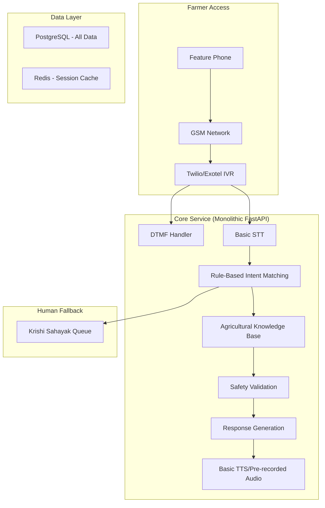
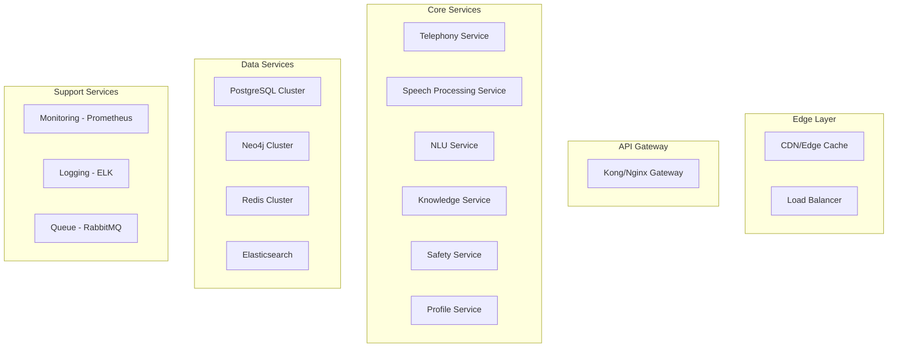
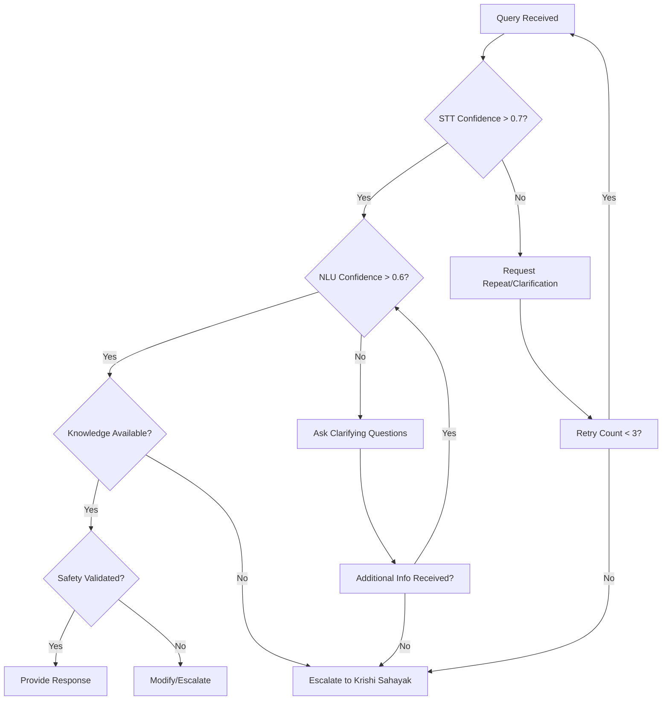

# Design Document: Rural Farming Assistant

## Overview

The Rural Farming Assistant is a voice-first AI system designed to bridge the digital divide for farmers in rural India. The system operates entirely through voice interactions over standard GSM networks, eliminating barriers of smartphone access, internet connectivity, and digital literacy.

The system follows a **phased implementation approach**:
- **Phase 1 (MVP)**: Monolithic architecture with rule-based system, DTMF fallback, 3 languages, 3 pilot districts
- **Phase 2 (AI-Enhanced)**: Add ML capabilities while maintaining monolithic core, 5 languages, 10 districts
- **Phase 3 (Scale)**: Evolve to microservices for critical components, 15+ languages, national deployment

Key design principles:
- **Voice-First**: All interactions are voice-based, no text or visual interfaces
- **Start Simple**: Rule-based MVP with progressive ML enhancement
- **Dialect-Aware**: Initial 3 languages, expanding to 15+ rural Indian dialects
- **Safety-Critical**: Multiple validation layers prevent harmful agricultural advice
- **Pragmatic Scaling**: Monolithic to start, microservices when proven necessary
- **Resilient**: Graceful degradation and human fallback mechanisms
- **Field-Validated**: Continuous farmer feedback drives design decisions

## Architecture

### Phase 1: MVP Architecture (Months 1-3)

Simple monolithic architecture with managed services:



### Phase 2: AI-Enhanced Architecture (Months 4-9)

Monolithic core with separated ML services:

```mermaid
graph TB
    subgraph "Farmer Access"
        A[Feature Phone] --> B[GSM/Telecom Edge]
    end

    subgraph "Core Service (Enhanced Monolithic)"
        B --> C[IVR Manager]
        C --> D[Hybrid Intent System]
        D --> E[ML Classifier|Rule Engine]
        E --> F[Knowledge Engine]
        F --> G[Dynamic Safety Layer]
    end

    subgraph "ML Services (Separate Containers)"
        H[STT Service - Whisper/Wav2Vec2]
        I[NLU Service - BERT-based]
        J[TTS Service - Neural Models]
    end

    subgraph "Data Layer"
        K[PostgreSQL - Main DB]
        L[Neo4j - Knowledge Graph]
        M[Redis - Hot Cache]
    end
```

### Phase 3: Scaled Microservices Architecture (Months 10+)

Full microservices for proven scale needs:



### Architecture Evolution Strategy

1. **Start Simple**: Monolithic FastAPI application with PostgreSQL and Redis
2. **Separate Compute-Heavy**: Extract STT/TTS as separate services when needed
3. **Scale Horizontally**: Add load balancers and replicas based on actual load
4. **Extract Services**: Only separate components that prove to need independent scaling
5. **Edge Deployment**: Partner with telecoms for edge caching in Phase 3

### Core Components by Phase

**Phase 1 (MVP)**:
1. **Managed Telephony**: Twilio/Exotel for IVR (avoid building from scratch)
2. **Rule-Based Processing**: Simple keyword matching for common queries
3. **Static Knowledge Base**: Curated FAQ-style responses
4. **DTMF Navigation**: Keypad fallback for all interactions
5. **Human Queue**: Direct escalation to Krishi Sahayak

**Phase 2 (AI-Enhanced)**:
1. **Telephony Gateway**: Custom integration with telecom providers
2. **Hybrid Processing**: ML for complex queries, rules for simple ones
3. **Dynamic Knowledge Engine**: Graph-based agricultural reasoning
4. **Confidence-Based Routing**: Smart escalation based on query risk
5. **Context Management**: Session and seasonal context retention

**Phase 3 (Scale)**:
1. **Edge Intelligence**: Models deployed at telecom edge nodes
2. **Full ML Pipeline**: End-to-end ML for all interactions
3. **Predictive Analytics**: Proactive alerts and recommendations
4. **Multi-Channel**: WhatsApp, SMS, USSD integration
5. **API Ecosystem**: Third-party integrations and white-labeling
## Components and Interfaces

### Telephony Gateway

**Responsibilities:**
- Missed call detection and callback initiation
- IVR flow management and call routing
- Audio quality monitoring and adaptation
- Session state management

**Key Interfaces:**
```typescript
interface TelephonyGateway {
    detectMissedCall(phoneNumber: string, timestamp: Date): CallbackRequest
    initiateCallback(request: CallbackRequest): CallSession
    handleIVRFlow(session: CallSession, userInput: AudioStream): IVRResponse
    adaptToNetworkQuality(session: CallSession, quality: NetworkQuality): void
}
```

**Technology Stack:**
- Asterisk or FreeSWITCH for telephony handling
- SIP protocol for call management
- WebRTC for audio processing
- Redis for session state management

### Speech-to-Text Engine

**Responsibilities:**
- Real-time transcription of rural Indian dialects
- Noise filtering and audio enhancement
- Confidence scoring for transcription quality
- Code-mixing and multilingual support

**Key Interfaces:**
```typescript
interface STTEngine {
    transcribe(audioStream: AudioStream, dialect: DialectCode): TranscriptionResult
    detectDialect(audioStream: AudioStream): DialectCode
    enhanceAudio(audioStream: AudioStream): AudioStream
    getConfidenceScore(transcription: string): number
}

interface TranscriptionResult {
    text: string
    confidence: number
    detectedDialect: DialectCode
    alternativeTranscriptions: string[]
}
```

**Technology Stack:**
- Custom fine-tuned Wav2Vec2 models for Indian languages
- Whisper as fallback for unsupported dialects
- PyTorch for model inference
- NVIDIA Triton for model serving
### Natural Language Understanding Module

**Responsibilities:**
- Intent classification for agricultural queries
- Entity extraction (crops, symptoms, locations)
- Context understanding and disambiguation
- Query confidence assessment

**Key Interfaces:**
```typescript
interface NLUModule {
    classifyIntent(text: string, context: ConversationContext): IntentClassification
    extractEntities(text: string, intent: Intent): EntityExtractionResult
    disambiguate(query: AmbiguousQuery, context: ConversationContext): DisambiguatedQuery
    assessConfidence(understanding: QueryUnderstanding): number
}

interface IntentClassification {
    intent: Intent
    confidence: number
    subIntents: Intent[]
}

enum Intent {
    CROP_DISEASE,
    PEST_CONTROL,
    IRRIGATION_ADVICE,
    WEATHER_QUERY,
    MARKET_PRICES,
    GOVERNMENT_SCHEMES,
    SOIL_HEALTH,
    SOWING_HARVESTING
}
```

**Technology Stack:**
- BERT-based models fine-tuned on agricultural corpus
- spaCy for entity recognition
- Custom rule-based patterns for agricultural terminology
- FastAPI for service endpoints

### Agricultural Knowledge Engine

**Responsibilities:**
- Disease identification from symptom descriptions
- Treatment and pesticide recommendations
- Weather-based irrigation advice
- Market price analysis and forecasting
- Government scheme matching

**Key Interfaces:**
```typescript
interface AgriculturalKnowledgeEngine {
    identifyDisease(symptoms: SymptomDescription, crop: CropType): DiseaseIdentification
    recommendTreatment(disease: Disease, crop: CropType, location: Location): TreatmentRecommendation
    getIrrigationAdvice(crop: CropType, weather: WeatherForecast, soilType: SoilType): IrrigationAdvice
    getMarketPrices(crop: CropType, location: Location): MarketPriceInfo
    findRelevantSchemes(farmer: FarmerProfile): GovernmentScheme[]
}

interface DiseaseIdentification {
    disease: Disease
    confidence: number
    alternativeDiseases: Disease[]
    requiredClarifications: string[]
}
```

**Technology Stack:**
- Neo4j graph database for agricultural knowledge representation
- scikit-learn for disease classification
- External APIs for weather and market data
- Custom rule engine for treatment recommendations
### Safety Validation Layer

**Responsibilities:**
- Validate all agricultural recommendations against safety guidelines
- Prevent harmful or banned substance recommendations
- Emergency situation detection and response
- Regulatory compliance checking

**Key Interfaces:**
```typescript
interface SafetyValidationLayer {
    validateRecommendation(recommendation: TreatmentRecommendation): ValidationResult
    checkEmergencyCondition(query: string): EmergencyResponse
    validatePesticideUsage(pesticide: Pesticide, crop: CropType, quantity: number): SafetyCheck
    auditRecommendation(recommendation: any, farmer: FarmerProfile): AuditLog
}

interface ValidationResult {
    isValid: boolean
    safetyWarnings: string[]
    requiredModifications: string[]
    escalationRequired: boolean
}
```

**Technology Stack:**
- PostgreSQL for regulatory guidelines database
- Custom validation rules engine
- Integration with government pesticide databases
- Audit logging with ELK stack

### Text-to-Speech Engine

**Responsibilities:**
- Generate natural-sounding speech in target dialects
- Adaptive prosody and pacing for agricultural content
- Multi-segment response structuring
- Voice quality optimization for telephony

**Key Interfaces:**
```typescript
interface TTSEngine {
    synthesize(text: string, dialect: DialectCode, prosody: ProsodySettings): AudioStream
    structureResponse(content: ResponseContent): StructuredAudio
    optimizeForTelephony(audio: AudioStream): AudioStream
    generateWithPauses(segments: string[]): AudioStream
}
```

**Technology Stack:**
- Custom neural TTS models trained on dialect-specific data
- SSML for prosody control
- Audio post-processing for telephony optimization
- Caching layer for common responses
## Data Models

### Core Domain Models

```typescript
interface Farmer {
    phoneNumber: string
    preferredDialect: DialectCode
    primaryCrops: CropType[]
    location: Location
    farmSize: number
    lastInteraction: Date
    interactionHistory: Interaction[]
    profileCompleteness: number
}

interface Interaction {
    sessionId: string
    timestamp: Date
    query: string
    intent: Intent
    entities: Entity[]
    response: string
    confidence: number
    escalated: boolean
    feedback: number // 1-5 rating
}

interface Disease {
    id: string
    name: string
    localNames: Map<DialectCode, string>
    symptoms: Symptom[]
    affectedCrops: CropType[]
    treatments: Treatment[]
    severity: SeverityLevel
    seasonality: Season[]
}

interface Treatment {
    id: string
    name: string
    type: TreatmentType // ORGANIC, CHEMICAL, CULTURAL
    activeIngredients: string[]
    dosage: DosageInfo
    applicationMethod: string
    safetyPrecautions: string[]
    waitingPeriod: number // days
    cost: CostRange
}

interface WeatherData {
    location: Location
    forecast: DailyForecast[]
    alerts: WeatherAlert[]
    lastUpdated: Date
}

interface MarketPrice {
    crop: CropType
    mandi: string
    price: number
    unit: string
    date: Date
    trend: PriceTrend
    quality: QualityGrade
}
```

### System Models

```typescript
interface CallSession {
    sessionId: string
    phoneNumber: string
    startTime: Date
    currentState: SessionState
    context: ConversationContext
    audioQuality: NetworkQuality
    retryCount: number
}

interface ConversationContext {
    previousQueries: string[]
    extractedEntities: Entity[]
    farmerProfile: Farmer
    currentTopic: Intent
    clarificationNeeded: boolean
}

interface DialectModel {
    code: DialectCode
    name: string
    region: string[]
    sttModelPath: string
    ttsModelPath: string
    supportedFeatures: LanguageFeature[]
    accuracy: number
}
```
## Correctness Properties

*A property is a characteristic or behavior that should hold true across all valid executions of a system—essentially, a formal statement about what the system should do. Properties serve as the bridge between human-readable specifications and machine-verifiable correctness guarantees.*

Based on the requirements analysis, the following correctness properties ensure the system operates safely and reliably across all farmer interactions:

### Property 1: Missed Call Detection and Callback
*For any* valid phone number that calls the system and disconnects within 3 rings, the system should detect the missed call, log it, and initiate a callback within 30 seconds with appropriate retry logic
**Validates: Requirements 1.1, 1.2, 1.3**

### Property 2: Speech Recognition Accuracy
*For any* supported rural dialect audio input, the STT engine should achieve minimum 75% word accuracy and handle code-mixing without requiring language switching
**Validates: Requirements 2.1, 2.3**

### Property 3: Real-time Processing Latency
*For any* speech input, the system should complete STT processing within 2 seconds and end-to-end query processing within 5 seconds
**Validates: Requirements 2.5, 14.2**

### Property 4: Query Classification and Entity Extraction
*For any* transcribed agricultural query, the NLU module should classify it into the correct category and extract all relevant entities (crop, symptoms, location, season, timeframe)
**Validates: Requirements 3.1, 3.2**

### Property 5: Confidence-Based Escalation
*For any* query or response with confidence score below the threshold (0.6 for understanding, 0.5 for disease identification), the system should either request clarification or escalate to Krishi Sahayak
**Validates: Requirements 3.4, 4.6, 10.1**

### Property 6: Disease Identification with Context
*For any* crop symptom description, the system should match against the disease knowledge base and provide disease-specific information considering crop type and regional conditions
**Validates: Requirements 4.1, 4.2, 4.5**

### Property 7: Comprehensive Safety Validation
*For any* treatment or pesticide recommendation, the safety layer should validate against approved guidelines, prevent banned substances, and include mandatory safety warnings for chemical treatments
**Validates: Requirements 5.2, 5.6, 13.1, 13.2, 13.4**

### Property 8: Treatment Recommendation Completeness
*For any* identified disease or pest, the system should provide both organic and chemical treatment options with complete dosage, application, and safety information
**Validates: Requirements 5.1, 5.3, 5.4**

### Property 9: Weather and Irrigation Context Integration
*For any* weather or irrigation query, the system should provide location-specific forecasts and consider crop type, growth stage, soil type, and upcoming weather in irrigation advice
**Validates: Requirements 6.1, 6.3**

### Property 10: Market Price Coverage and Freshness
*For any* market price request, the system should provide prices from at least 3 nearby mandis (within 50km), include price trends, and ensure data is updated within 24 hours
**Validates: Requirements 7.1, 7.2, 7.3, 7.4**

### Property 11: Government Scheme Filtering and Information
*For any* government scheme query, the system should filter schemes based on available farmer information and provide complete eligibility, application, and contact details
**Validates: Requirements 8.1, 8.2, 8.3**

### Property 12: Dialect-Consistent Voice Response
*For any* farmer query, the TTS engine should generate responses in the same dialect used by the farmer with appropriate prosody and structured segments with pauses
**Validates: Requirements 9.1, 9.2, 9.4**

### Property 13: Response Timing and Structure
*For any* system response, individual segments should not exceed 30 seconds and multi-step instructions should be clearly numbered with replay options
**Validates: Requirements 9.3, 9.5**

### Property 14: Context Retention and Personalization
*For any* returning farmer, the system should maintain their profile, greet them with acknowledgment of previous interactions, and retain context from the last 5 interactions
**Validates: Requirements 12.1, 12.2, 12.3, 12.4**

### Property 15: Emergency Response
*For any* query detected as an emergency situation, the safety layer should provide immediate safety guidance and emergency contact numbers
**Validates: Requirements 13.3**

### Property 16: Network Quality Adaptation
*For any* call experiencing network quality degradation, the system should adapt by simplifying responses and requesting shorter inputs while maintaining functionality
**Validates: Requirements 11.3, 11.6**

### Property 17: Comprehensive Interaction Logging
*For any* system interaction, all relevant data (transcriptions, classifications, confidence scores, outcomes, escalations, recommendations) should be logged for monitoring and compliance
**Validates: Requirements 1.5, 10.6, 13.6, 15.1**

### Property 18: Load Management and Queuing
*For any* system load exceeding capacity, calls should be queued with estimated wait time announcements while maintaining service availability
**Validates: Requirements 14.4**

### Property 19: Metrics and Performance Tracking
*For any* system operation, key metrics (resolution rate, escalation rate, call duration, retention) should be tracked and daily reports generated
**Validates: Requirements 15.2, 15.3, 15.5**

### Property 20: Krishi Sahayak Context Transfer
*For any* escalation to human experts, the system should provide complete query transcription and conversation context while attempting dialect matching
**Validates: Requirements 10.3, 10.4**
## Error Handling

### Error Categories and Responses

**1. Speech Recognition Errors**
- Low audio quality: Request farmer to speak closer to phone or move to quieter location
- Unrecognized dialect: Attempt with fallback models, escalate to Krishi Sahayak if needed
- Background noise: Guide farmer to quieter location, apply noise filtering
- Network issues: Adapt audio processing parameters, reduce response complexity

**2. Understanding Errors**
- Low NLU confidence: Ask clarifying questions in simpler language
- Ambiguous queries: Present options for farmer to choose from
- Unknown agricultural terms: Request description using common words
- Multiple intents: Break down into separate questions and handle sequentially

**3. Knowledge Base Errors**
- Disease not found: Escalate to Krishi Sahayak with detailed symptom information
- Outdated information: Flag for knowledge base update, provide best available data with disclaimer
- Regional data missing: Use nearest available data with clear geographical disclaimer
- Conflicting recommendations: Present multiple options with trade-offs explained

**4. System Errors**
- Service unavailable: Provide estimated restoration time, offer scheduled callback
- Database timeout: Use cached responses where safe, escalate complex queries
- TTS failure: Use pre-recorded fallback messages in default regional language
- Call quality degradation: Simplify responses, offer to call back with better connection

### Graceful Degradation Strategy



### Emergency Handling

For critical situations (poisoning, severe injury, crop failure):
1. **Immediate Response**: Provide safety guidance in farmer's dialect
2. **Emergency Contacts**: Share poison control, veterinary, and medical emergency numbers
3. **Expert Escalation**: Connect to nearest available Krishi Sahayak immediately
4. **Follow-up Protocol**: Schedule follow-up call within 2 hours
5. **Incident Logging**: Create detailed incident report for pattern analysis and system improvement

### Fallback Mechanisms

**Human Fallback**: When AI confidence drops below thresholds, seamlessly transfer to Krishi Sahayak with full context
**Cached Responses**: Use pre-validated cached responses for common queries when live systems are unavailable
**Simplified Mode**: Reduce system complexity during network or processing constraints
**Offline Scheduling**: Allow farmers to schedule callbacks when systems are temporarily unavailable
## Testing Strategy

The testing approach combines unit testing for individual components with property-based testing for system-wide correctness guarantees, ensuring both concrete functionality validation and universal correctness properties.

### Unit Testing Approach

**Component-Level Testing:**
- **STT Engine**: Accuracy testing with dialect-specific audio datasets, noise filtering validation
- **NLU Module**: Intent classification accuracy with agricultural query corpus, entity extraction precision
- **Knowledge Engine**: Disease identification accuracy with symptom variations, treatment recommendation validation
- **Safety Layer**: Validation with known harmful scenarios, regulatory compliance checking
- **TTS Engine**: Voice quality assessment with native speaker evaluation, dialect consistency testing

**Integration Testing:**
- **End-to-End Call Flows**: Complete missed call to response cycles
- **Multi-Component Error Handling**: Cascading failure scenarios and recovery
- **Performance Testing**: Load testing with concurrent calls, latency measurement
- **Network Adaptation**: Testing with varying network quality conditions
- **Escalation Workflows**: Krishi Sahayak handoff procedures and context transfer

**Test Data Strategy:**
- **Synthetic Audio Generation**: Create dialect-specific test audio for STT validation
- **Crowdsourced Queries**: Collect real farmer queries for NLU training and testing
- **Expert-Validated Mappings**: Disease-symptom relationships validated by agricultural experts
- **Regulatory Test Cases**: Comprehensive safety and compliance validation scenarios
- **Performance Benchmarks**: Establish baseline metrics for latency, accuracy, and throughput

### Property-Based Testing Configuration

Property-based tests will use **Hypothesis** (Python) for backend services and **fast-check** (TypeScript) for Node.js components. Each test will run a minimum of 100 iterations to ensure comprehensive input coverage.

**Framework Selection:**
- **Python Services**: Hypothesis for STT, NLU, Knowledge Engine, and Safety Layer
- **Node.js Services**: fast-check for Telephony Gateway and API services
- **Integration Tests**: Custom test harnesses combining both frameworks

**Test Configuration:**
- **Minimum 100 iterations** per property test to ensure statistical significance
- **Custom generators** for agricultural domain objects (crops, diseases, symptoms, treatments)
- **Shrinking strategies** for complex failure cases to identify minimal failing examples
- **Timeout limits** appropriate for telephony constraints (5-second response limits)
- **CI/CD Integration** for continuous validation with every code change

**Property Test Tagging:**
Each property-based test will include a comment tag referencing the design document property:
```python
# Feature: rural-farming-assistant, Property 1: Missed Call Detection and Callback
```

**Custom Generators:**
- **Phone Number Generator**: Valid Indian mobile numbers with regional codes
- **Dialect Audio Generator**: Synthetic speech samples across supported dialects
- **Agricultural Query Generator**: Realistic farmer queries with symptoms, crops, and locations
- **Weather Data Generator**: Realistic weather patterns for different Indian regions
- **Market Price Generator**: Realistic price data with trends and seasonal variations

### Dual Testing Benefits

**Unit Tests provide:**
- Concrete validation of specific examples and edge cases
- Integration point verification between system components
- Error condition handling and boundary value testing
- Regression prevention for known issues

**Property Tests provide:**
- Universal correctness guarantees across all possible inputs
- Comprehensive input space coverage through randomization
- Discovery of unexpected edge cases and corner conditions
- Validation of system invariants under all conditions

**Together they ensure:**
- **Comprehensive Coverage**: Unit tests catch concrete bugs, property tests verify general correctness
- **Safety Assurance**: Critical for agricultural advice where incorrect recommendations could cause harm
- **Scalability Validation**: Property tests verify system behavior under diverse load conditions
- **Regulatory Compliance**: Both approaches needed to meet safety and audit requirements

This dual approach is essential for the Rural Farming Assistant given its safety-critical nature and the need to handle the vast diversity of rural Indian dialects, agricultural conditions, and farmer needs reliably.