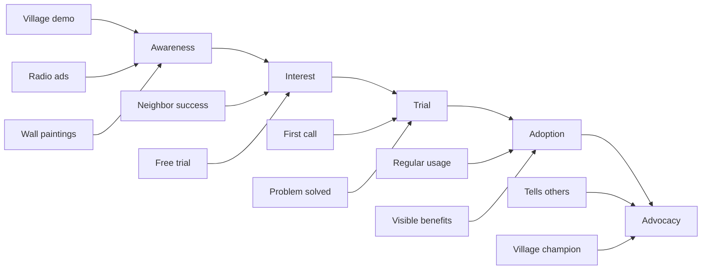

# Go-to-Market Strategy: Rural Farming Assistant

## Executive Summary

This document outlines the comprehensive go-to-market (GTM) strategy for the Rural Farming Assistant, designed to drive adoption among rural Indian farmers while building trust, demonstrating value, and achieving sustainable scale. The strategy emphasizes grassroots engagement, cultural sensitivity, and phased geographic expansion.

## Market Analysis

### Target Market Segmentation

#### Primary Segment: Progressive Small Farmers
- **Size**: 30 million farmers
- **Land Holding**: 1-3 hectares
- **Characteristics**:
  - Open to new technologies
  - Active information seekers
  - Influence community decisions
  - Regular mobile phone users
- **Pain Points**:
  - Lack of timely advisory
  - Limited access to experts
  - Language barriers with formal extension
  - High cost of crop failure

#### Secondary Segment: Marginal Farmers
- **Size**: 90 million farmers
- **Land Holding**: <1 hectare
- **Characteristics**:
  - Risk-averse
  - Limited resources
  - Dependent on traditional practices
  - Basic phone users
- **Pain Points**:
  - Cannot afford private advisory
  - Limited market access
  - High input costs
  - Vulnerability to climate change

#### Tertiary Segment: Women Farmers
- **Size**: 40 million (active in farming)
- **Characteristics**:
  - Limited mobility
  - Manage kitchen gardens and livestock
  - Influence household decisions
  - Prefer voice communication
- **Pain Points**:
  - Excluded from extension services
  - Limited direct market access
  - Need flexible timing for advisory
  - Safety concerns with unknown contacts

### Competitive Landscape

| Competitor | Strengths | Weaknesses | Our Differentiation |
|------------|-----------|------------|-------------------|
| mKisan (Govt) | Free, government backing | Text-based, limited reach | Voice-first, dialect support |
| KisanCall (Govt) | Toll-free, established | Limited hours, long wait | 24/7 AI-powered, instant response |
| AgroStar | E-commerce integration | App-based, requires smartphone | Feature phone compatible |
| DeHaat | End-to-end services | Limited geographic presence | Focused advisory, wider reach |
| Plantix | Image-based diagnosis | Requires smartphone, internet | Voice-based description works |

### Market Opportunity

```yaml
Total Addressable Market (TAM):
  Farmers in India: 146 million
  Feature phone users: 120 million
  Annual advisory spend: ₹5,000 Cr

Serviceable Addressable Market (SAM):
  Target states farmers: 60 million
  Willing to use voice services: 30 million
  Potential revenue: ₹1,500 Cr

Serviceable Obtainable Market (SOM):
  5-year target: 1 million farmers
  Market share: 3.3%
  Revenue potential: ₹35 Cr
```

## Value Proposition

### Core Value Statement

**"घर बैठे, अपनी भाषा में, मुफ्त कृषि सलाह"**
(Agricultural advice at home, in your language, for free)

### Value Pillars

1. **Accessibility**
   - Works on any phone
   - No internet required
   - Available 24/7
   - Free basic service

2. **Localization**
   - 15+ rural dialects
   - Local crop focus
   - Regional practices
   - Cultural sensitivity

3. **Reliability**
   - Government validated content
   - Expert-backed advice
   - Proven solutions
   - Safety validated

4. **Immediacy**
   - Instant response
   - Real-time advisory
   - Emergency support
   - Timely alerts

## Adoption Strategy

### The Farmer Adoption Journey



### Phase 1: Build Trust (Months 1-3)

#### Village Entry Strategy

**Week 1: Official Introduction**
- Meeting with Sarpanch (village head)
- Presentation to Panchayat
- Get official endorsement
- Identify progressive farmers

**Week 2: Community Demonstration**
```
Demonstration Script:
1. Gather 20-30 farmers
2. Show live service demo
3. Solve real farmer query
4. Share success stories
5. Register interested farmers
6. Distribute pamphlets
```

**Week 3: Influencer Activation**
- Train 2-3 progressive farmers
- Provide special recognition
- Create "Village Champions"
- Incentivize referrals

**Week 4: Mass Awareness**
- Wall paintings at key locations
- Loudspeaker announcements
- Distribution at weekly markets
- Temple/Mosque announcements

#### Trust Building Tactics

1. **Government Association**
   - Use government logos (with permission)
   - Get Collector endorsement
   - Agricultural Officer presence
   - Link to government schemes

2. **Local Validation**
   - Use local success stories
   - Farmer testimonials in dialect
   - Before/after yield comparisons
   - Cost savings documentation

3. **Risk Mitigation**
   - Emphasize free service
   - No registration complexity
   - Instant callback (no cost)
   - Human expert backup

### Phase 2: Drive Trial (Months 4-6)

#### Activation Campaigns

**"Missed Call Campaign"**
```
Message: "किसान भाई, खेती की समस्या?
983XXXXXXX पर मिस्ड कॉल करें,
हम वापस फोन करेंगे - बिल्कुल मुफ्त!"

Translation: "Farmer brother, farming problem?
Give missed call to 983XXXXXXX,
We'll call back - completely free!"
```

**Seasonal Campaigns**
- **Kharif Season**: "Monsoon crop advisory"
- **Rabi Season**: "Wheat sowing guidance"
- **Harvest Time**: "Market price alerts"
- **Input Season**: "Fertilizer optimization"

**Problem-Specific Campaigns**
- Pest outbreak alerts
- Weather warnings
- Government scheme deadlines
- Market price opportunities

#### Conversion Tactics

1. **First Call Excellence**
   - Ensure 100% callback success
   - Resolve first query completely
   - Provide unexpected value
   - Request second call commitment

2. **Follow-Up Strategy**
   - SMS thank you (where possible)
   - Check problem resolution
   - Remind about service
   - Share new features

3. **Incentive Programs**
   - Certificate after 5 calls
   - Recognition in village
   - Priority support status
   - Exclusive content access

### Phase 3: Sustain Adoption (Months 7-12)

#### Engagement Programs

**Farmer Clubs**
- Monthly village meetings
- Success story sharing
- Group problem solving
- Collective learning

**Seasonal Advisories**
- Proactive alerts
- Crop calendars
- Weather warnings
- Price opportunities

**Gamification Elements**
- Village leaderboards
- Farmer of the month
- Knowledge contests
- Reward points

#### Retention Strategies

1. **Personalization**
   - Remember farmer's name
   - Track their crops
   - Provide targeted advice
   - Anniversary greetings

2. **Value Addition**
   - New features regularly
   - Exclusive content
   - Expert webinars
   - Market connections

3. **Community Building**
   - WhatsApp groups (where applicable)
   - Village success celebrations
   - Farmer meets
   - Knowledge sharing sessions

## Marketing and Communication

### Brand Identity

**Brand Name**: कृषि मित्र (Krishi Mitra - Farm Friend)

**Logo Elements**:
- Green field imagery
- Mobile phone icon
- Rising sun (progress)
- Hindi/regional script

**Tagline Options**:
1. "आपका अपना खेती सलाहकार" (Your own farming advisor)
2. "बोलिए, हम सुन रहे हैं" (Speak, we're listening)
3. "हर किसान का साथी" (Every farmer's companion)

### Marketing Channels

#### Traditional Media (60% budget)

**Radio**
- All India Radio agricultural programs
- Local FM channels
- 30-second spots during prime time
- Farmer testimonials

**Print**
- Regional newspapers (agricultural pages)
- Village notice boards
- Pamphlets at input dealers
- Agricultural magazines

**Outdoor**
- Wall paintings in villages
- Bus stand posters
- Mandi (market) banners
- Input shop branding

#### On-Ground Activities (30% budget)

**Village Events**
- Krishi melas (agricultural fairs)
- Demonstration plots
- Farmer field days
- Harvest celebrations

**Partnership Events**
- KVK training programs
- Cooperative society meetings
- SHG gatherings
- Panchayat sessions

#### Digital Media (10% budget)

**YouTube**
- Success story videos
- How-to-use tutorials
- Expert interviews
- Farmer testimonials

**WhatsApp**
- Forward-friendly content
- Voice notes
- Success images
- Service reminders

### Content Strategy

#### Message Framework

**Awareness Stage**:
- Problem agitation
- Solution introduction
- Free service emphasis
- Easy access highlight

**Consideration Stage**:
- Success stories
- Expert credibility
- Feature benefits
- Trust indicators

**Decision Stage**:
- Call to action
- Phone number repetition
- Urgency creation
- Risk removal

#### Content Calendar

```markdown
Monthly Themes:
- January: Rabi crop care
- February: Pest management
- March: Harvest preparation
- April: Summer crop planning
- May: Water conservation
- June: Monsoon preparation
- July: Kharif sowing
- August: Fertilizer management
- September: Disease control
- October: Market preparation
- November: Post-harvest
- December: Soil health
```

## Geographic Rollout Plan

### Phase 1: Pilot States (Year 1)

**Maharashtra**
- Districts: 5 (Nashik, Pune, Ahmednagar, Solapur, Kolhapur)
- Farmers: 50,000
- Crops: Grapes, onions, sugarcane, cotton
- Language: Marathi

**Tamil Nadu**
- Districts: 5 (Thanjavur, Coimbatore, Salem, Tirupur, Erode)
- Farmers: 50,000
- Crops: Rice, cotton, sugarcane, vegetables
- Language: Tamil

**Uttar Pradesh**
- Districts: 5 (Meerut, Aligarh, Agra, Lucknow, Varanasi)
- Farmers: 50,000
- Crops: Wheat, rice, sugarcane, vegetables
- Language: Hindi

### Phase 2: Expansion States (Year 2)

**Second Wave States**:
- Punjab (wheat, rice)
- Haryana (wheat, cotton)
- Andhra Pradesh (rice, cotton)
- Karnataka (coffee, spices)
- Gujarat (cotton, groundnut)

**Target**: 200,000 additional farmers

### Phase 3: National Coverage (Year 3-5)

**Remaining States Priority**:
1. High agricultural GDP states
2. Government partnership states
3. Strong telecom infrastructure
4. Active FPO presence

**Target**: 1 million farmers by Year 5

## Launch Strategy

### Soft Launch (Month 1)

**Select 3 Villages per District**
- 50 farmers per village
- Intensive hand-holding
- Daily monitoring
- Rapid iteration

**Success Metrics**:
- 80% activation rate
- 60% week-1 retention
- 4.0/5 satisfaction
- 2+ calls per farmer

### District Launch (Month 2)

**Scale to Full District**
- 1,000 farmers per district
- Mass awareness campaign
- Media coverage
- Government launch event

**Launch Event Template**:
```
Chief Guest: District Collector
Venue: Agricultural Office
Attendees: 200+ farmers
Agenda:
- Official inauguration
- Live demonstration
- Success testimonials
- Registration drive
- Media interaction
```

### State Launch (Month 3)

**State-Wide Rollout**
- All selected districts
- State minister launch
- Media blitz
- Celebrity endorsement

## Performance Metrics

### Adoption Metrics

| Metric | Target (Month 3) | Target (Month 6) | Target (Year 1) |
|--------|-----------------|------------------|-----------------|
| Registered farmers | 5,000 | 25,000 | 150,000 |
| Activated farmers | 3,000 | 15,000 | 100,000 |
| Monthly active users | 2,000 | 10,000 | 75,000 |
| Calls per farmer | 2 | 4 | 6 |
| Retention rate | 40% | 60% | 70% |

### Engagement Metrics

| Metric | Target | Measurement |
|--------|--------|-------------|
| First call completion | 90% | Call logs |
| Query resolution | 70% | Farmer feedback |
| Repeat usage (week 2) | 50% | System data |
| Referral rate | 20% | Registration source |
| NPS score | 40+ | Post-call survey |

### Impact Metrics

| Metric | Target | Timeline |
|--------|--------|----------|
| Yield improvement | 10% | Season end |
| Input cost reduction | 15% | 6 months |
| Income increase | 20% | Annual |
| Pesticide reduction | 25% | Season end |
| Market price improvement | 10% | 6 months |

## Risk Mitigation

### Adoption Risks and Mitigation

| Risk | Mitigation Strategy |
|------|-------------------|
| Low awareness | Intensive ground campaigns, multiple touchpoints |
| Trust deficit | Government endorsement, local testimonials |
| Technology fear | Simple missed call, human fallback |
| Language barriers | Hyperlocal dialect support |
| No immediate value | Quick wins, seasonal relevance |
| Competing services | Clear differentiation, unique value |
| Network issues | SMS fallback, offline camps |
| Behavior change | Gradual adoption, peer pressure |

## Budget Allocation

### Year 1 GTM Budget: ₹1.5 Crore

| Category | Allocation | Amount (INR) |
|----------|------------|--------------|
| Ground Activities | 40% | 60,00,000 |
| Traditional Media | 25% | 37,50,000 |
| Content Creation | 15% | 22,50,000 |
| Digital Marketing | 10% | 15,00,000 |
| Events & Demos | 10% | 15,00,000 |

### Cost Per Acquisition

```yaml
Target Metrics:
  Cost per registration: ₹10
  Cost per activation: ₹50
  Cost per active user: ₹200

ROI Calculation:
  Customer lifetime value: ₹3,000
  Acquisition cost: ₹200
  ROI: 15x
```

## Success Factors

### Critical Success Factors

1. **Local Trust Building**
   - Village influencer buy-in
   - Government endorsement
   - Visible success stories
   - Community ownership

2. **Service Excellence**
   - First call resolution
   - Dialect accuracy
   - Relevant content
   - Quick response

3. **Sustained Engagement**
   - Regular value delivery
   - Seasonal relevance
   - Community building
   - Continuous improvement

4. **Ecosystem Integration**
   - Input dealer partnerships
   - Mandi connections
   - Government schemes
   - Financial services

## Conclusion

The go-to-market strategy for Rural Farming Assistant emphasizes trust-building through local engagement, value demonstration through practical solutions, and sustainable adoption through community-driven growth. Success depends on cultural sensitivity, ground-level execution excellence, and continuous adaptation based on farmer feedback.

By focusing on solving real farmer problems in their own language through accessible technology, the service can achieve viral adoption within farming communities and create lasting agricultural transformation across rural India.