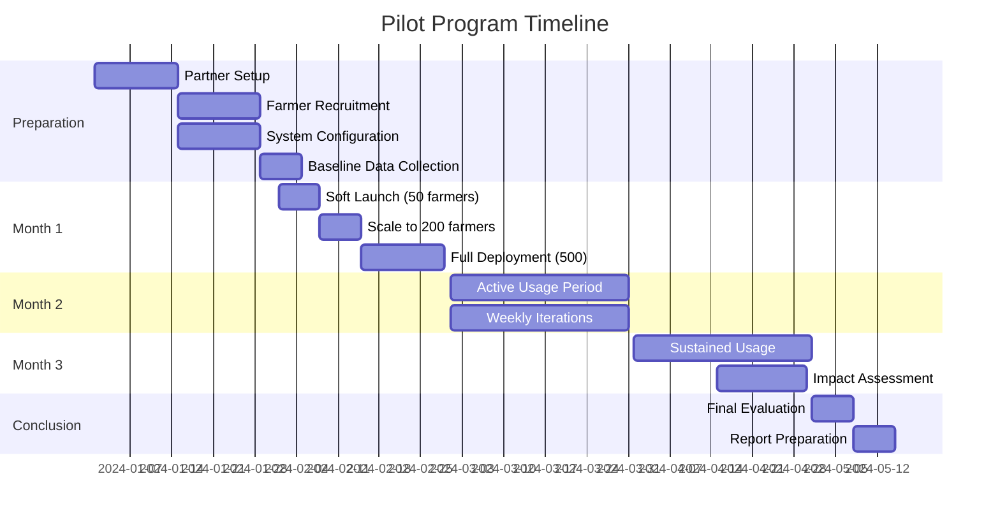

# Pilot Program Design: Rural Farming Assistant

## Executive Summary

This document outlines the comprehensive pilot program for the Rural Farming Assistant, designed to validate the system with real farmers before full-scale deployment. The pilot follows a phased approach across three diverse districts, focusing on measurable outcomes, continuous iteration, and farmer-centric validation.

## Pilot Objectives

### Primary Objectives
1. **Validate Core Assumptions**: Test if farmers will adopt voice-based agricultural advisory
2. **Measure Impact**: Quantify agricultural and economic benefits
3. **Refine Technology**: Improve accuracy based on real-world usage
4. **Prove Economics**: Validate unit costs and sustainability model
5. **Build Evidence**: Generate data for government and investor support

### Secondary Objectives
- Test different implementation models
- Identify cultural and regional variations
- Build local partnership networks
- Train Krishi Sahayak volunteers
- Create farmer success stories

## Pilot Design Framework

### Geographic Selection Criteria

#### Selected Districts

**District 1: Nashik, Maharashtra**
- **Language**: Marathi (Varhadi dialect)
- **Primary Crops**: Grapes, onions, tomatoes
- **Why Selected**:
  - Progressive farming community
  - Mix of commercial and subsistence farming
  - Strong agricultural extension presence
  - Good mobile network coverage
- **Target Farmers**: 500
- **Partner**: MPKV Rahuri, Nashik District Agricultural Office

**District 2: Thanjavur, Tamil Nadu**
- **Language**: Tamil (Thanjavur dialect)
- **Primary Crops**: Paddy, pulses, sugarcane
- **Why Selected**:
  - Traditional farming heartland
  - Delta region with unique challenges
  - Active farmer producer organizations
  - Previous digital intervention experience
- **Target Farmers**: 500
- **Partner**: TNAU, Thanjavur Agricultural Department

**District 3: Sitapur, Uttar Pradesh**
- **Language**: Hindi (Awadhi influence)
- **Primary Crops**: Wheat, rice, sugarcane
- **Why Selected**:
  - Large marginal farmer population
  - Limited agricultural extension reach
  - Diverse cropping patterns
  - Representative of Hindi belt
- **Target Farmers**: 500
- **Partner**: ICAR-IISR, UP Agriculture Department

### Farmer Selection and Recruitment

#### Inclusion Criteria
- Owns/operates 0.5 to 5 hectares of land
- Uses feature phone (not mandatory to have smartphone)
- Primary occupation is farming
- Willing to participate for full pilot duration
- Mix of age groups (25-65 years)
- At least 30% women farmers

#### Recruitment Strategy

**Village Selection** (5 villages per district):
```
Per District:
- 2 Progressive villages (early adopters)
- 2 Average villages (typical farmers)
- 1 Remote village (connectivity challenges)
```

**Farmer Mobilization Process**:
1. **Week 1**: Village panchayat introduction meetings
2. **Week 2**: Farmer group demonstrations (10-15 farmers)
3. **Week 3**: Individual registration and consent
4. **Week 4**: Distribution of information materials
5. **Week 5**: Service activation and training

**Incentive Structure**:
- No monetary incentive for participation (avoid bias)
- Free service during pilot period
- Certificate of participation from government
- Priority access to new features
- Soil testing camps as engagement activity

## Pilot Timeline and Phases

### Overall Timeline: 3 Months Active Pilot



### Phase-wise Implementation

#### Pre-Pilot Phase (4 Weeks Before Launch)

**Week -4: Partnership Activation**
- Sign MoUs with district agricultural departments
- Identify and train local coordinators
- Set up district-level project offices
- Configure telecom infrastructure

**Week -3: Volunteer Recruitment**
- Identify 10 Krishi Sahayak volunteers per district
- 3-day training program on system usage
- Create volunteer support groups
- Establish compensation mechanisms

**Week -2: Farmer Recruitment**
- Village-level meetings and demonstrations
- Registration of interested farmers
- Collect baseline agricultural data
- Create farmer WhatsApp groups for updates

**Week -1: System Testing**
- Test toll-free number accessibility
- Verify language and dialect configurations
- Conduct dry runs with volunteers
- Fine-tune content for local crops

#### Month 1: Controlled Launch

**Week 1: Soft Launch (50 farmers/district)**
- Close monitoring of every call
- Daily feedback collection
- Immediate issue resolution
- Refine IVR flows

**Week 2: Gradual Scaling (200 farmers/district)**
- Add farmers in batches of 50
- Monitor system stability
- Track query patterns
- Adjust capacity as needed

**Week 3-4: Full Deployment (500 farmers/district)**
- Open access to all registered farmers
- Launch awareness campaign
- Activate all features
- Begin regular monitoring

#### Month 2: Active Usage and Iteration

**Daily Operations**:
- Monitor call volumes and patterns
- Track query resolution rates
- Collect farmer feedback
- Address technical issues

**Weekly Iterations**:
- Monday: Analyze previous week's data
- Tuesday: Prioritize improvements
- Wednesday: Implement changes
- Thursday: Test updates
- Friday: Deploy improvements

**Focus Areas**:
- Improve speech recognition accuracy
- Add missing agricultural content
- Optimize response times
- Enhance IVR navigation

#### Month 3: Sustained Usage and Assessment

**Weeks 9-11: Sustained Usage**
- Maintain consistent service
- Document usage patterns
- Collect success stories
- Prepare for impact assessment

**Week 12: Impact Assessment**
- Conduct endline surveys
- Measure agricultural outcomes
- Calculate economic benefits
- Document lessons learned

## Data Collection Framework

### Baseline Data Collection

**Farmer Profile Survey**:
```yaml
Demographics:
  - Age, gender, education level
  - Household size, income sources
  - Mobile phone usage patterns

Agricultural Profile:
  - Land holding size, ownership type
  - Crops grown, cropping patterns
  - Current advisory sources
  - Major challenges faced

Technology Readiness:
  - Mobile phone type and usage
  - Language preferences
  - Previous digital service usage
  - Comfort with IVR systems

Baseline Metrics:
  - Current yield levels
  - Input costs
  - Market price realization
  - Crop losses (disease/pest)
```

### Continuous Monitoring Metrics

#### System Metrics (Collected Automatically)

**Daily Metrics**:
- Number of calls received
- Unique farmers calling
- Call duration distribution
- Query categories
- Language/dialect usage
- Resolution rates
- Escalation rates
- Technical errors

**Weekly Metrics**:
- Farmer retention rate
- Repeat usage patterns
- Most common queries
- Satisfaction scores
- Feature utilization
- Peak usage times
- Geographic distribution

#### Impact Metrics (Collected Monthly)

**Agricultural Outcomes**:
- Pest/disease identification accuracy
- Treatment adoption rates
- Reported crop loss reduction
- Yield improvement indicators
- Input cost optimization

**Behavioral Changes**:
- Advisory source shifting
- Technology comfort increase
- Information seeking patterns
- Decision-making improvements

**Economic Impact**:
- Cost savings reported
- Better price realization
- Reduced crop losses
- Income improvements

### Data Collection Methods

#### Quantitative Methods

**Call Data Analytics**:
- Automatic call logging
- Query classification tracking
- Resolution pathway analysis
- Time-series usage patterns

**Structured Surveys**:
- Baseline survey (Week 0)
- Midline survey (Week 6)
- Endline survey (Week 12)
- SMS-based pulse surveys (weekly)

**A/B Testing**:
```python
Test Variants:
  Variant A: Rule-based responses only
  Variant B: AI-enhanced responses

Metrics:
  - Resolution rate
  - Call duration
  - Satisfaction score
  - Escalation rate
```

#### Qualitative Methods

**In-Depth Interviews**:
- 10 farmers per district per month
- Focus on usage experience
- Understand behavior change
- Document success stories

**Focus Group Discussions**:
- 3 FGDs per district
- 8-10 farmers per group
- Gender-separate groups
- Discussion topics:
  - Service usefulness
  - Trust and credibility
  - Improvement suggestions
  - Adoption barriers

**Case Studies**:
- 5 detailed case studies per district
- Document full journey
- Before-after comparisons
- Photo/video documentation

## Success Metrics and KPIs

### Primary Success Metrics

| Metric | Target | Measurement Method |
|--------|--------|-------------------|
| Adoption Rate | 60% of registered farmers use service | Call logs |
| Repeat Usage | 40% farmers call >3 times/month | System data |
| Query Resolution | 70% queries resolved without escalation | Call analytics |
| Farmer Satisfaction | 4.0/5.0 average rating | Post-call IVR |
| Cost per Query | <₹15 per successful resolution | Financial analysis |

### Secondary Success Metrics

| Metric | Target | Measurement Method |
|--------|--------|-------------------|
| Disease Identification Accuracy | 80% correct identification | Farmer feedback |
| Yield Improvement | 10% reported improvement | Endline survey |
| Input Cost Reduction | 15% reduction reported | Farmer interviews |
| Women Farmer Usage | 30% of users are women | Registration data |
| Volunteer Effectiveness | 80% escalations resolved | Support tickets |

### Comparison Metrics

**Control Group Comparison**:
- Identify 100 non-participant farmers per district
- Similar demographic and agricultural profile
- Compare agricultural outcomes
- Measure differential impact

**Baseline Comparison**:
- Compare endline with baseline data
- Track individual farmer journeys
- Measure behavior change
- Document outcome improvements

## Operational Plan

### Pilot Team Structure

```
National Level:
- Pilot Program Director
- Technical Lead
- Data Analytics Lead
- Partnership Coordinator

District Level (per district):
- District Coordinator
- Field Officers (2)
- Krishi Sahayak Coordinator
- Data Collection Officer

Village Level:
- Village Volunteers (2 per village)
- Progressive Farmer Champions
- Women Group Leaders
```

### Daily Operations Schedule

**Morning (9 AM - 12 PM)**:
- Peak call time monitoring
- Real-time issue resolution
- Volunteer availability ensure
- Content updates if needed

**Afternoon (2 PM - 5 PM)**:
- Field visits and farmer meetings
- Data collection activities
- Volunteer training sessions
- Partner coordination

**Evening (5 PM - 8 PM)**:
- Second peak usage period
- Call quality monitoring
- Daily report preparation
- Team debriefing

### Communication and Reporting

**Daily Reports**:
- Call volume and patterns
- Technical issues and resolutions
- Farmer feedback summary
- Next day priorities

**Weekly Reports**:
- Usage analytics and trends
- Success stories and challenges
- Iteration implementations
- Partner feedback

**Monthly Reports**:
- Comprehensive metrics analysis
- Impact assessment progress
- Budget utilization
- Strategic recommendations

## Risk Management

### Operational Risks

| Risk | Mitigation Strategy |
|------|-------------------|
| Low adoption | Intensive awareness campaigns, local influencers |
| Network issues | SMS fallback, edge caching, multiple telecom partners |
| Language accuracy | Continuous training data collection, human fallback |
| Volunteer dropout | Incentive structure, recognition, backup volunteers |
| Technical failures | 24/7 monitoring, quick response team, redundancy |

### External Risks

| Risk | Mitigation Strategy |
|------|-------------------|
| Weather disruptions | Flexible timeline, seasonal adjustments |
| Political changes | Multi-party engagement, apolitical positioning |
| Competing services | Differentiation, partnership approach |
| Farmer skepticism | Success story propagation, trust building |
| Partner delays | Multiple partners, contingency plans |

## Budget

### Pilot Program Budget (3 Months)

| Category | Amount (INR) | Details |
|----------|--------------|---------|
| **Operations** | | |
| Staff Salaries | 15,00,000 | Coordinators, field officers |
| Volunteer Incentives | 3,00,000 | ₹100/hour for Krishi Sahayaks |
| Field Operations | 2,00,000 | Travel, meetings, logistics |
| **Technology** | | |
| Telecom Costs | 5,00,000 | Toll-free number, call costs |
| Infrastructure | 3,00,000 | Servers, cloud services |
| **Data Collection** | | |
| Surveys and Studies | 4,00,000 | Baseline, endline, analysis |
| External Evaluation | 2,00,000 | Third-party assessment |
| **Marketing** | | |
| Awareness Campaigns | 3,00,000 | Materials, events, media |
| **Contingency** | 3,00,000 | 10% buffer |
| **Total** | **40,00,000** | ~$48,000 USD |

## Success Criteria for Scale-Up

### Go Decision Criteria
✅ Adoption rate exceeds 60%
✅ Query resolution exceeds 70%
✅ Cost per query below ₹15
✅ Farmer satisfaction above 4.0/5.0
✅ Positive agricultural outcomes documented
✅ Sustainable unit economics validated
✅ Partner commitment for scale-up
✅ Government support secured

### No-Go Decision Criteria
❌ Adoption below 30%
❌ Resolution rate below 50%
❌ Cost per query above ₹30
❌ Farmer satisfaction below 3.0/5.0
❌ No measurable agricultural impact
❌ Unsustainable economics
❌ Partner withdrawal
❌ Technical issues unresolved

### Pivot Decision Criteria
🔄 Adoption 30-60%: Adjust approach
🔄 High costs: Optimize operations
🔄 Low satisfaction: Improve experience
🔄 Technical issues: Enhance system
🔄 Partner concerns: Renegotiate terms

## Post-Pilot Roadmap

### Scenario 1: Successful Pilot
1. Prepare scale-up proposal
2. Secure funding for expansion
3. Recruit additional team
4. Expand to 10 districts
5. Launch Phase 2 features

### Scenario 2: Partial Success
1. Extend pilot by 3 months
2. Implement major improvements
3. Re-evaluate metrics
4. Adjust strategy
5. Limited scale-up

### Scenario 3: Unsuccessful Pilot
1. Conduct deep analysis
2. Document learnings
3. Consider major pivot
4. Explore alternative approaches
5. Sunset or transform project

## Conclusion

This pilot program is designed to provide comprehensive validation of the Rural Farming Assistant concept while maintaining flexibility for iteration and improvement. Success depends on strong local partnerships, continuous farmer engagement, and rapid response to feedback. The pilot will generate crucial evidence for scaling decisions and provide insights for creating a truly transformative agricultural advisory service for India's farmers.